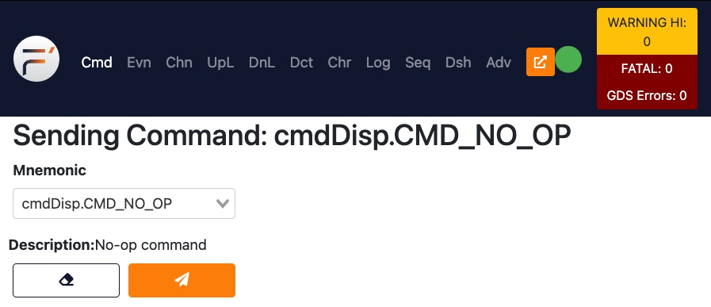
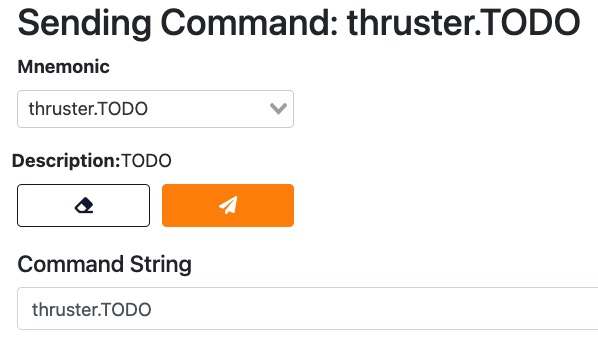
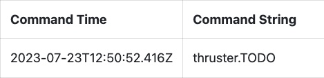
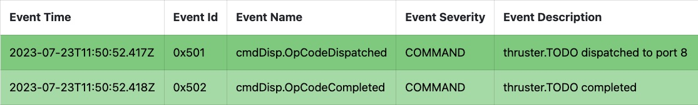

Run GDS
=======

Be sure you're in the ``SpacecraftDeployment`` directory.

Execute one of these two commands, depending on your development environment (see the previous tutorial for details).

Either:

.. code-block:: bash

    fprime-gds

or:

.. code-block:: bash

    fprime-gds --gui-addr 0.0.0.0

Several log info messages are displayed, with the last line saying ``F prime is now running.``

.. code-block:: text

    [INFO] F prime is now running. CTRL-C to shutdown all components.

Open a web browser
------------------
If you're working natively or locally, a web browser window should have opened automatically.
Otherwise, open a web browser and navigate to http://localhost:5000.

Notice the green circle icon in the upper right corner: this shows that the flight software deployment has connected to the GDS system.
You may have to wait a few seconds for the red X to change into a green circle.
If the red X does not change into a green circle, then navigate to the **Log** tab and look for error messages.

Using the GDS
-------------
Click the **Mnemonic** drop-down box to see all the commands that are provided by the components in your flight software deployment.
Locate and select the command **thruster.TODO**.

Recall that ``thruster`` is the name we gave to the instance, and ``TODO`` is the name of the command that was defined in the ``.fpp`` file.

Press the orange ``Send Command`` button to send the command to the thruster.

The command log at the bottom of the window should indicate that the command was sent.
Your **Command Time** will be different from mine, but the **Command String** should be the same.

If you click the **Events** tab at the top of the screen you should see three events listed:

These two events describe the lifecycle of the command that you sent.

Conclusion
----------

Congratulations! You have successfully deployed your first F' project and controlled it from the GDS application.

You can press ^C (Ctrl-C) in the ``fprime-gds`` terminal window to terminate the GDS server.
