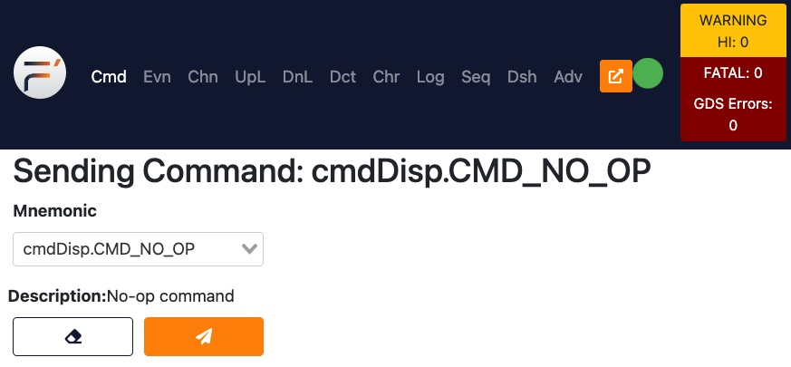

Run GDS
=======

Be sure you're in the ``SpacecraftDeployment`` directory.

Choose how to start ``fprime-gds``
----------------------------------
**(DIRECT)** If one of these options descibes your development environment:

* Natively (without VirtualBox or a VM)
* Directly in the Linux VM (using the Linux graphical desktop)
* Windows Subsystem for Linux

then you can just enter this command in a Linux terminal:

.. code-block:: bash

    fprime-gds

**(REMOTE)** However, if you've been working through a remote conection to the Linux VM, then you should enter this command in a terminal window in your *host OS* terminal window (i.e. Windows or MacOs) where you've been entering all your other commands:

.. note::

    This assumes that you've already mapped port 5000 in the VM.
    This was covered in the first "System setup" tutorial.

.. code-block:: bash

    fprime-gds --gui-addr 0.0.0.0

The extra ``--gui`` arguments will ensure that your web browser will be able to connect to the ``fprime-gds`` web server running in the VM.

Observe the output
------------------
Several log info messages are displayed, with the last line saying ``F prime is now running.``

.. code-block:: text

    [INFO] Autodetected artifacts root '/home/jeff/workspace/ComponentExample/ComponentExampleDeployment/build-artifacts' from deployment settings.ini file.
    [INFO] Ensuring TCP Server is stable for at least 5 seconds
    [INFO] Running Application: /home/jeff/workspace/ComponentExample/venv/bin/python3
    [INFO] Log File: /home/jeff/workspace/ComponentExample/ComponentExampleDeployment/logs/2023_07_22-12_17_03/ThreadedTCP.log
    [INFO] Ensuring comm[ip] Application is stable for at least 1 seconds
    [INFO] Running Application: /home/jeff/workspace/ComponentExample/venv/bin/python3
    [INFO] Ensuring ComponentExampleDeployment Application is stable for at least 1 seconds
    [INFO] Running Application: /home/jeff/workspace/ComponentExample/ComponentExampleDeployment/build-artifacts/Linux/ComponentExampleDeployment/bin/ComponentExampleDeployment
    [INFO] Log File: /home/jeff/workspace/ComponentExample/ComponentExampleDeployment/logs/2023_07_22-12_17_03/ComponentExampleDeployment.log
    [INFO] Ensuring HTML GUI is stable for at least 2 seconds
    [INFO] Running Application: /home/jeff/workspace/ComponentExample/venv/bin/python3
    * Serving Flask app 'fprime_gds.flask.app'
    * Debug mode: off
    [INFO] F prime is now running. CTRL-C to shutdown all components.

Open a web browser
------------------
If you're working natively or locally, a web browser window should have opened automatically.
Otherwise, open a web browser and navigate to http://localhost:5000.

Notice the green circle icon in the upper right corner: this shows that the flight software deployment has connected to the GDS system.
You may have to wait a few seconds for the red X to change into a green circle.
If the red X does not change into a green circle, then navigate to the **Log** tab and look for error messages.

Using the GDS
-------------
Click the **Mnemonic** drop-down box to see all the commands that are provided by the components in your flight software deployment.
These components were included in your deployment automatically and are needed for any basic F' deployment.
You're welcome to explore this web interface to your spacecraft, but in the next tutorial I'll show you how to create your own component and send a command to it using the GDS.

Conclusion
----------
Congratulations! You have successfully deployed your first F' project and connected to it from the GDS application.

You can press ^C (Ctrl-C) in the ``fprime-gds`` terminal window to terminate the GDS server.
